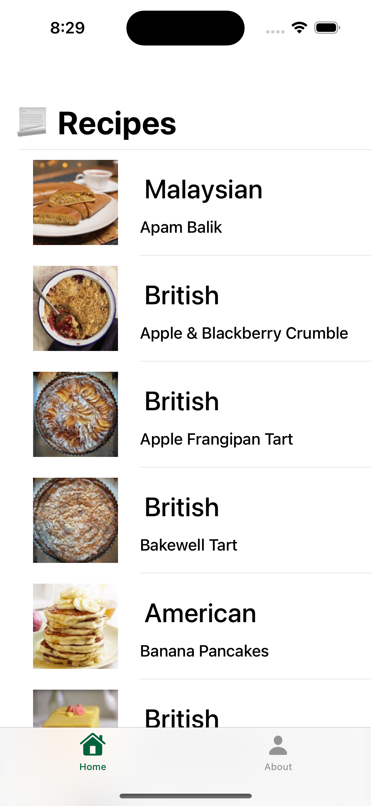
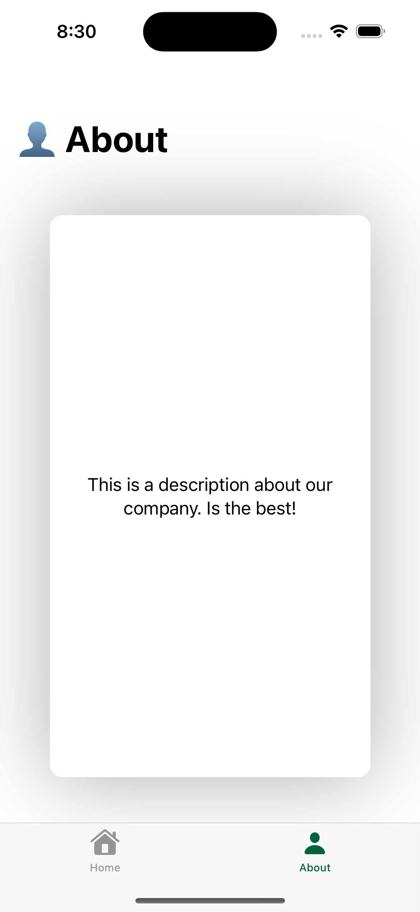
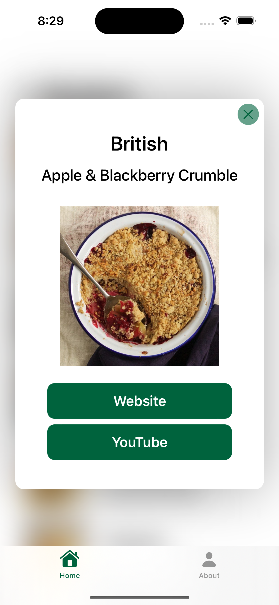
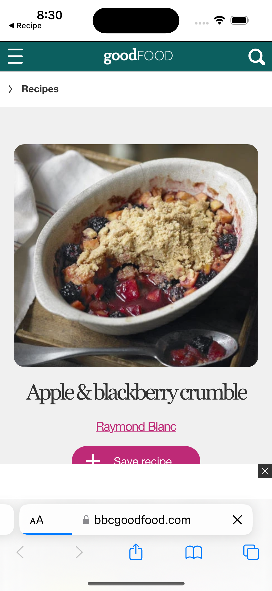
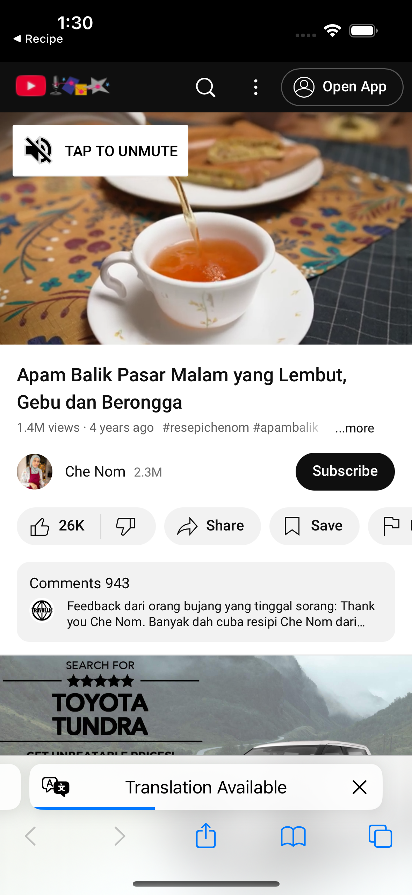
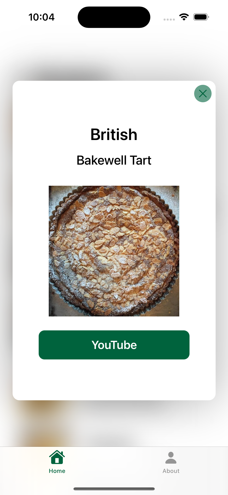

# Table of Contents
1. [Description](#description)
2. [Architecture](#architecture)
3. [Structure](#structure)
4. [Running the tests](#running-the-tests)
5. [Focus Areas](#focus-areas)
6. [Time Spent](#time-spent)
7. [Trade-offs](#trade-offs)
8. [Weaknest Part of the Project](#weaknest-part-of-the-project)

# Recipe App
 A project that shows a list of recipes from different country’s cuisine types.

# Description

The Recipe project has two tab option one is for  displays recipes from different country’s cuisine types and the other is about the company. It is designed using SwiftUI to take advantage of its capabilities.

The project consists of displaying a recipe list that shows the cuisine, name and photo of the recipe.

  

  

When the user selects (taps) in any of the recipes a new view is displayed with the recipe’s details. 
 
 

  

 If the recipe has a source or a YouTube channel the user can press the button and the app will redirect you to the site.
 

  
   

You can go back to the app just press in the top of the left corner when the name of the app is displayed (Recipe).

The app only displays the buttons if the recipe has a source or a YouTube link.
 
 

  

# Architecture

The recipe app is implemented using Model-View-View-Model (MVVM) architecture pattern.

* The model has any necessary data or business logic needed to generate the Recipe’s List from an API.
* The view is responsible for displaying the View to the user, such as Recipe List and Recipe Details. 
* The controller handles any user interactions and updates the Model and View as needed.
* The ViewModel interacts between the model who has the data and the View who displays the UI for the user.

# Structure 
* ""Model": File that created the recipe’s models and is used across multiple parts of the project.
* "Utilities": Files or resources that are shared across multiple parts of the project. Such as constant enum, alerts, extensions and Manager. Inside of this group there is a NetworkManager: Singleton class related to communicating with an external API. This could include code for making HTTP requests to a web server, parsing responses, and handling any errors that may occur.
* "Views": Files that content folder as Buttons, Image, Cells, UIKit, for managed design in the user’s views.
* "Screens": Files or resources that content the View and the ViewModel’s user.

# Running the tests

The Recipe project can be tested using the built-in framework XCTest. 
I created two files for the test RecipeDetailsViewModelTest and RecipeListViewModelTest.

# Focus Areas
 I focused mainly on the ux of the main features of the project. I prioritized the RecipeListView because I needed to download the data and parse it to be displayed in the List with the correct information.
This View took me more time because I needed to make sure that downloading, caching and displaying were functioning 

# Time Spent
For this project I spent 7 hours divided into various days.

# Trade-offs

* I did not make the NetworkManager injected. 
* I did not consider edgeCases and did not implement Pagination.

# Weaknest Part of the Project
For this project, Unit Testing is something new for me, and I try to understand the majority of logic for the test but I need more improvement in  this part.

Another point is async/await is really new for me to work in this Swift Concurrency.

